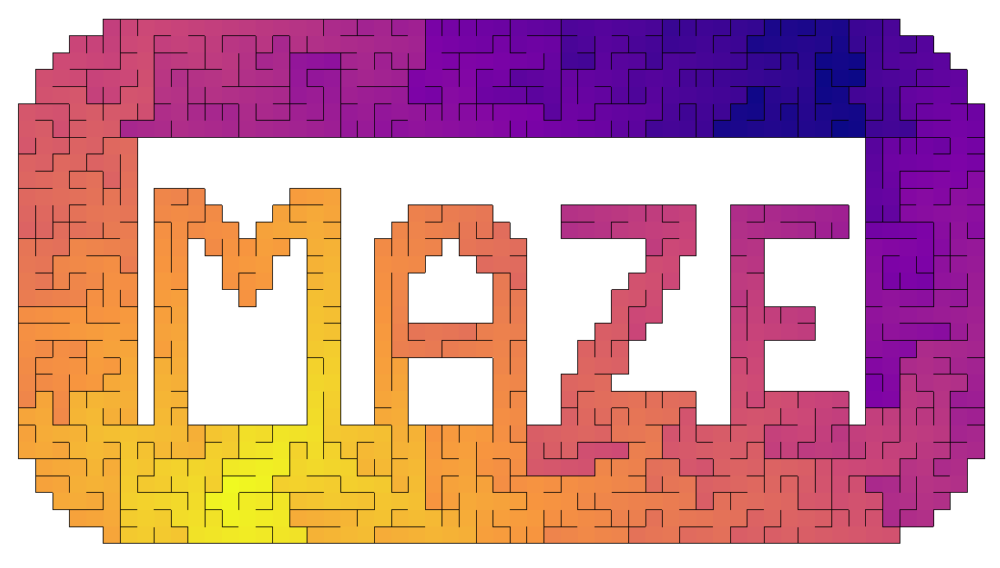

# Labyrint-lab i Kotlin

*Basert på boken "Mazes for Programmers" av Jamis Buck*

> Gira på å bare hoppe rett i det? Koden ligger
> i [desktop/src/com/mygdx/kotlinmazes](desktop/src/com/mygdx/kotlinmazes/scenes/BinaryTreeAnimated.kt)

## Hva kan jeg gjøre?

- Implementer flere labyrint-algoritmer. Sjekk
  ut [mazegeneration/README.md](desktop/src/com/mygdx/kotlinmazes/mazegeneration/README.md)
- Implementer flere typer grids. Sjekk ut [grids/README.md](desktop/src/com/mygdx/kotlinmazes/grids/README.md)
- Lag en ny scene! For eksempel:
    - Ta inspirasjon fra `scenes/SquareGridDistanceClick.kt` og lag en scene hvor du klikker på to celler for å tegne
      raskeste vei mellom de to
    - Lag en scene hvor du lager labyrinter ved å klikke på celler for å linke de til hverandre
    - Maskering - "drep" celler ved å fjerne koblingen til naboenene, for å lage "maskerte" labyrinter med unike
      former (som bildet over)

Oppgaver:
Lag nye grids
Lag nye algortimer for oppretting
Lag nye algoritmer for løsing
Gjør en algoritme "steppet"
Maskering av andre grids
Lag noe helt annet?
En scene hvor du navigerer selv
Klikk to punkter, finn raskeste vei
Klikk et punkt, finn fjerneste punkt
Lengste distanse

Lage noe med solving
Lage noe stepped med solving
Sjekke at alle eksistere scener kjører

Hva skal være igjen?
SquareGrid
HexGrid
MaskedGrid?
BinaryTree stepped
En "generisk" algoritme - AldousBroder?
DFS