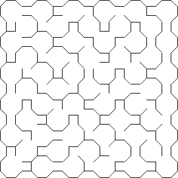
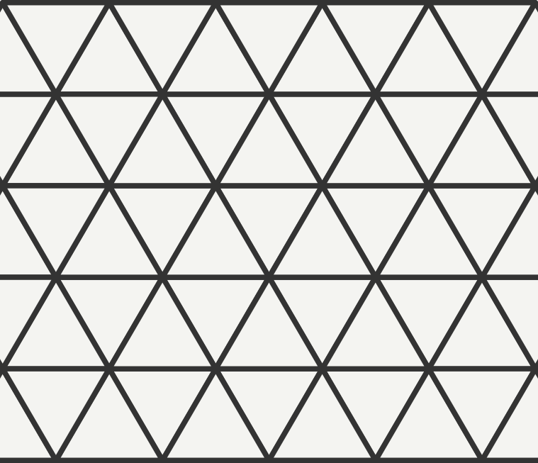

# Grids

## Hvordan lage et grid?

Begynn med å implementere subklasser av de abstrakte klassene `Grid` og `Cell`.  
For å tegne gridet kan det være lurt med en "drawer"-klasse - ta inspirasjon fra `SquareGridDrawer` i `drawer`-pakken.  
Alternativt kan du gjøre tegning rett i scenen din, sånn som i `scenes/DrawPolarGrid.kt`.

> ⚠️ Dette er en stor oppgave, som kan inneholde en del knoting med geometri og matematikk
> Jeg (Sondre) har per nå (2024-12-12) ikke implementert disse selv - jeg hjelper deg veldig gjerne, men jeg har ikke
> fasiten!

## Noen forslag:

### "Upsilon"-grid

I boka nevner forfatteren det han kaller et "Upsilon-grid", en kombinasjon av oktagoner og kvadrater:

Hvis du vil prøve å lage dette selv, kan du
følge [denne bloggposten](https://weblog.jamisbuck.org/2015/11/28/upsilon-mazes.html) av forfatteren selv!  
Her går han gjennom hvordan han implementerte det i Ruby, og viser geometrien du trenger for å bygge en "drawer" for
dette gridet.

### Trekant-grid

Stable likebente trekanter oppå hverandre, og du får et grid som ligner på dette:

Denne siden har en fin beskrivelse av hvordan du kan lage et slikt grid:  
https://www.boristhebrave.com/2021/05/23/triangle-grids/