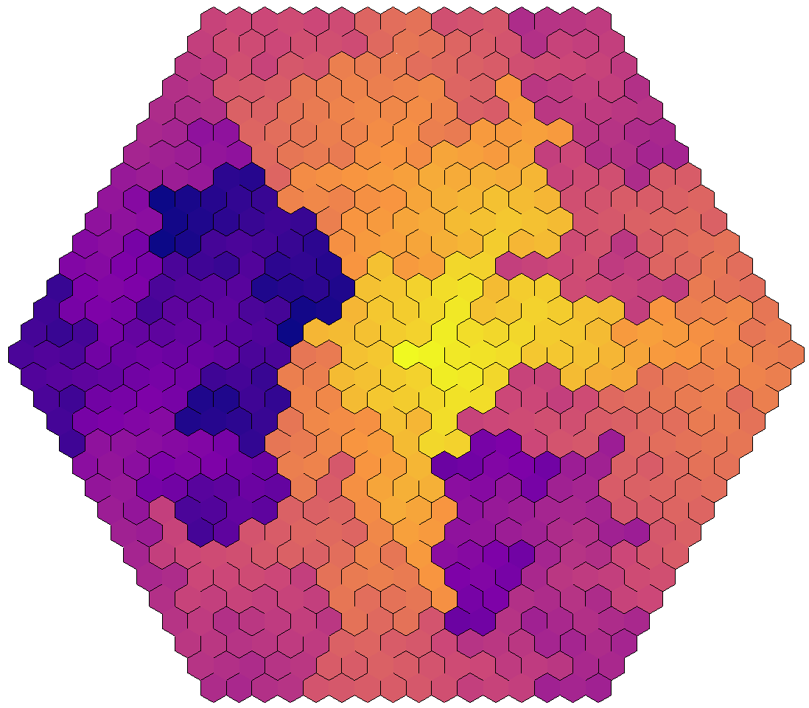

# Grids

## Hvordan lage et grid?

Begynn med å implementere subklasser av de abstrakte klassene `Grid` og `Cell`.  
For å tegne gridet kan det være lurt med en "drawer"-klasse - ta inspirasjon fra `SquareGridDrawer` i `drawer`-pakken.  
Alternativt kan du gjøre tegning rett i scenen din, sånn som i `scenes/DrawPolarGrid.kt`.

## Noen forslag:

### "Upsilon"-grid

I boka nevner forfatteren det han kaller et "Upsilon-grid", en kombinasjon av oktagoner og kvadrater:

Hvis du vil prøve å lage dette selv, kan du
følge [denne bloggposten](https://weblog.jamisbuck.org/2015/11/28/upsilon-mazes.html) av forfatteren selv!  
Her går han gjennom hvordan han implementerte det i Ruby, og viser geometrien du trenger for å bygge en "drawer" for
dette gridet.

### Trekant-grid

Stable likebente trekanter oppå hverandre, og du får et grid som ligner på dette:

### Hex-grid

Hex-grid er kjempekule!

Dette er en litt større oppgave, og kan ta en stund å gjennomføre. Hvis du vil bryne deg på utfordringen vil jeg veldig
sterkt anbefale [denne bloggposten](https://www.redblobgames.com/grids/hexagons/), som går gjennom koordinatsystemer,
naboberegning og geometri (og mye mer!) for hexagoner.
