# Labyrint-genererende funksjoner

Det er mange forskjellige måter å generere labyrinter på.

Prøv å implementere algoritmen slik at den kan håndtere de abstrakte `Grid` og `Cell`-klassene, slik at du kan prøve ut
algoritmen på forskjellige typer grids!
Det kan hende du må utvide `Grid`-klassen med noen metoder for å få det til å fungere.


> 💡 **Tips! Holde styr på "unvisited" celler**
>
> Ofte står det i pseudokoden at man skal markere celler som unvisited eller visited.
> Hvis celler som markeres som visited, også alltid linkes til en annen celle, kan man bruke hvorvidt cellen har en
> lenke for å sjekke om den er visited.
> Altså ved å sjekke `cell.links.isEmpty()` eller `cell.links.isNotEmpty()`

## Aldous-Broder

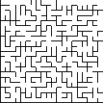
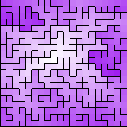

```raw
choose a random cell
set remaining count to number of cells - 1
while remaining count > 0
    choose a random neighbor of current cell
    if neighbor has no links
        link current cell and neighbor
        remaining count -= 1
        
    move to the neighbor
```

## Wilson's

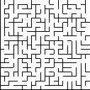
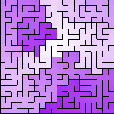

```raw
mark all cells as unvisited
choose a random cell and mark it as visited

while there are unvisited cells
    current = random unvisited cell
    path = [current]
    while current is unvisited
        current = random neighbor of current
        if current is in path
            remove all cells in path after current
        else
            append current to path
    
    for each cell in path
        link cell to the next cell in path
        mark cell as visited
```

## Hunt and kill

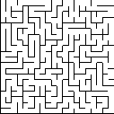
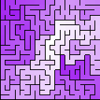

```raw
mark all cells as unvisited
current = random cell
mark current as visited
while there are unvisited cells
    candidates = neighbors of current that are unvisited
    if candidates is not empty
        next = random candidate
        link current and next
        mark next as visited
        current = next
    else
        current = unvisited cell with at least one visited neighbor
        neighbor = random visited neighbor of current
        link current and neighbor
        mark current as visited
```

## Recursive backtracker

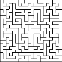


```raw
mark all cells as unvisited
first = random cell (or start at a specific cell)
mark first as visited
stack = [first]
while stack is not empty
    current = stack.pop()
    candidates = neighbors of current that are unvisited
    if candidates is not empty
        next = random candidate
        link current and next
        mark next as visited
        stack.push(next)
    else
        stack.pop()
```

## Recursive division

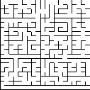
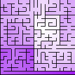

```raw
link all cells to their neighbors
divide(0, 0, width, height)

function divide(x, y, width, height)
    if width <= 1 or height <= 1
        return
    if width > height
        divideVertically(x, y, width, height)
    else 
        divideHorizontally(x, y, width, height)
        
function divideVertically(x, y, width, height)
    divideWidth = random number between 0 and width - 1
    openingHeight = random number between 0 and height
    for 0 <= i < height
        if i != openingHeight
            find cell at row = y + i, column = x + divideWidth
            unlink cell with eastern neighbor
    divide(x, y, divideWidth + 1, height)
    divide(x + divideWidth + 1, y, width - divideWidth - 1, height)
    
function divideHorizontally(x, y, width, height)
    divideHeight = random number between 0 and height - 1
    openingWidth = random number between 0 and width
    for 0 <= i < width
        if i != openingWidth
            find cell at row = y + divideHeight, column = x + i
            unlink cell with northern neighbor
    divide(x, y, width, divideHeight + 1)
    divide(x, y + divideHeight + 1, width, height - divideHeight - 1)
```

> ⚠️ Obs: denne er ikke rett frem å implementere animert (steppet), siden den er rekursiv  
> Trikset er å bruke en stack med `Room(x, y, width, height)`. I stedet for å kalle `divide` direkte, legg til et nytt
> `Room` på stacken.
> Du er ferdig når stacken er tom

## Prim's

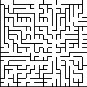
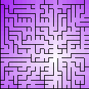

```raw
mark all cells as unvisited
first = random cell (or start at a specific cell)
mark fist as visited
active = [first]

while active is not empty
    current = random active cell
    candidates = neighbors of current that are unvisited
    if candidates is not empty
        neighbor = random candidate
        link current and neighbor
        mark neighbor as visited
        add neighbor to active
    else
        remove current from active
```

## Andre

- Binary tree
- Sidewinder
- Eller's
- Kruskal's
- Growing tree