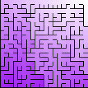
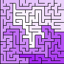

# Labyrint-genererende funksjoner

Det er mange forskjellige måter å generere labyrinter på.

Prøv å implementere algoritmen slik at den kan håndtere de abstrakte `Grid` og `Cell`-klassene, slik at du kan prøve ut
algoritmen på forskjellige typer grids!
Det kan hende du må utvide `Grid`-klassen med noen metoder for å få det til å fungere.


> 💡 **Tips! Holde styr på "unvisited" celler**
>
> Ofte står det i pseudokoden at man skal markere celler som unvisited eller visited.
> Hvis celler som markeres som visited, også alltid linkes til en annen celle, kan man bruke hvorvidt cellen har en
> lenke for å sjekke om den er visited.
> Altså ved å sjekke `cell.links.isEmpty()` eller `cell.links.isNotEmpty()`

## Binary Tree


Sterk diagonal tekstur, siden den alltid linker til nord eller øst.
Alle de nordligste cellene er lenket til hverandre, og alle de østligste cellene er lenket til hverandre.

```raw
for each cell
    candidates = [cell to the north if it exists, cell to the east if it exists]
    neighbor = random candidate
    link cell and neighbor
```

## Sidewinder




Øverste raden er alltid lenket sammen.

```raw
for each row
    run = []
    for each cell in the row
        run.add(cell)
        isAtEasternBoundary = true if eastern neighbor does not exist
        isAtNorthernBoundary = true if northern neighbor does not exist
        shouldCloseOut = isAtEasternBoundary or (not isAtNorthernBoundary and randomBoolean())
        if shouldCloseOut
            member = random cell from run
            if member has northern neighbor
                link member and northern neighbor of member
            run = []
        else
           link cell and eastern neighbor of cell
```

## Aldous-Broder


Ubiased, velger blant alle gyldige labyrinter med lik sannsynlighet.

```raw
choose a random cell
set remaining count to number of cells - 1
while remaining count > 0
    choose a random neighbor of current cell
    if neighbor has no links
        link current cell and neighbor
        remaining count -= 1
        
    move to the neighbor
```

## Wilson's


Ubiased, velger blant alle gyldige labyrinter med lik sannsynlighet.

```raw
mark all cells as unvisited
choose a random cell and mark it as visited

while there are unvisited cells
    current = random unvisited cell
    path = [current]
    while current is unvisited
        current = random neighbor of current
        if current is in path
            remove all cells in path after current
        else
            append current to path
    
    for each cell in path
        link cell to the next cell in path
        mark cell as visited
```

## Hunt and kill


Lange korridorer, færre korte blindveier.

```raw
mark all cells as unvisited
current = random cell
mark current as visited
while there are unvisited cells
    candidates = neighbors of current that are unvisited
    if candidates is not empty
        next = random candidate
        link current and next
        mark next as visited
        current = next
    else
        current = unvisited cell with at least one visited neighbor
        neighbor = random visited neighbor of current
        link current and neighbor
        mark current as visited
```

## Recursive backtracker




Lange korridorer, færre korte blindveier.

```raw
first = random cell (or start at a specific cell)
stack = [first]
while stack is not empty
    current = stack.pop()
    candidates = neighbors of current that have no links
    if candidates is not empty
        next = random candidate
        link current and next
        stack.push(next)
    else
        stack.pop()
```

## Recursive division


Rektangulære rom med en enkelt åpning mellom hver "boks". Kan få lange rette korridorer, hvis et rom får dimensjoner 1 x
N
eller N x 1.

```raw
link all cells to their neighbors
divide(0, 0, width, height)

function divide(x, y, width, height)
    if width <= 1 or height <= 1
        return
    if width > height
        divideVertically(x, y, width, height)
    else 
        divideHorizontally(x, y, width, height)
        
function divideVertically(x, y, width, height)
    divideWidth = random number between 0 and width - 1
    openingHeight = random number between 0 and height
    for 0 <= i < height
        if i != openingHeight
            find cell at row = y + i, column = x + divideWidth
            unlink cell with eastern neighbor
    divide(x, y, divideWidth + 1, height)
    divide(x + divideWidth + 1, y, width - divideWidth - 1, height)
    
function divideHorizontally(x, y, width, height)
    divideHeight = random number between 0 and height - 1
    openingWidth = random number between 0 and width
    for 0 <= i < width
        if i != openingWidth
            find cell at row = y + divideHeight, column = x + i
            unlink cell with northern neighbor
    divide(x, y, width, divideHeight + 1)
    divide(x, y + divideHeight + 1, width, height - divideHeight - 1)
```

> ⚠️ Obs: denne er ikke rett frem å implementere animert (steppet), siden den er rekursiv  
> Trikset er å bruke en stack med `Room(x, y, width, height)`. I stedet for å kalle `divide` direkte, legg til et nytt
> `Room` på stacken.
> Du er ferdig når stacken er tom

## Prim's (forenklet)


Tekstur som "stråler" ut fra startpunktet.

```raw
first = random cell (or start at a specific cell)
active = [first]

while active is not empty
    current = random active cell
    candidates = neighbors of current that have no links
    if candidates is not empty
        neighbor = random candidate
        link current and neighbor
        add neighbor to active
    else
        remove current from active
```

## Andre

- Eller's
- Kruskal's
- Growing tree